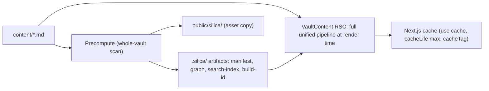

# Silica: Next.js framework for publishing Obsidian vaults

## 1. Product shape

The user's project is **just markdown and config** — no Next.js scaffolding visible:

```
my-vault/
  content/                          # markdown vault — the user's primary input
    index.md
    notes/foo.md
    attachments/...
  themes/                           # OPTIONAL — only if user is building a custom theme
    my-theme/...
  public/                           # OPTIONAL — user-owned static assets (favicon, etc.)
  silica.config.ts                  # theme, auth allowlist, plugins
  tsconfig.json                     # standard TS config
  package.json                      # scripts: silica dev / silica build / silica start
  .env                              # auth secrets (gitignored)
  .env.example                      # checked-in template
  .gitignore                        # ignores .silica/, node_modules
```

That's it. **No `app/`, no `proxy.ts`, no `next.config.ts` at the project root.** The full Next.js app is treated as a build artifact and lives entirely inside `.silica/next/`, which is gitignored and regenerated on every `silica dev` / `silica build`:

```
my-vault/
  .silica/                          # BUILD ARTIFACT (gitignored, regenerated each run)
    manifest.json                   # slug → file map
    graph.json                      # link graph
    search-index.json               # serialized FlexSearch
    build-id.txt                    # opaque id, stamped into cacheTag()
    next/                           # the materialized Next.js project
      app/
        layout.tsx
        [[...slug]]/page.tsx
        tags/[tag]/page.tsx
        sign-in/page.tsx
        not-allowed/page.tsx
        not-found.tsx
        api/auth/[...all]/route.ts
        api/search/route.ts
      proxy.ts
      next.config.ts                # sets experimental.externalDir: true, etc.
      package.json                  # stub
      tsconfig.json                 # extends ../../tsconfig.json
      public/                       # vault assets + symlinked user public/
        silica/...                  # vault-asset namespace
        favicon.ico                 # symlink to user's, if any
      .next/                        # next build output
```

Every file under `.silica/next/` is generated by the CLI from templates baked into `@silicajs/next`. **The user never sees these and never edits them.** If they disappear they're regenerated from scratch on the next run. No `silica upgrade` is needed because there's no committed scaffold to upgrade — bumping `@silicajs/next` and re-running `silica dev` is the upgrade.

DX target (Mintlify-feel):

- `silica create <dir>` — scaffolds a minimal project tree (just the user-facing files above).
- `silica dev` — materializes `.silica/next/`, runs the precompute, symlinks `.env` and user's `public/` into `.silica/next/`, then `next dev --dir .silica/next/` with a chokidar watcher on `content/` + `silica.config.ts` that triggers `/__silica/revalidate` on changes.
- `silica build` — same materialization + precompute, then `next build --dir .silica/next/`. Output ends up at `.silica/next/.next/`.
- `silica start` — `next start --dir .silica/next/` for self-hosted production serving.
- Zero config required; everything overrideable via `silica.config.ts`.

## 2. Monorepo layout

**npm workspaces + Turborepo** (Turborepo as the task runner, with `npm` as the underlying package manager — no pnpm):

```
silica/
  packages/
    core/              @silicajs/core          markdown pipeline, slug system, types
    next/              @silicajs/next          Next.js routes, primitives, proxy
    cli/               @silicajs/cli           `silica` binary
    create/            create-silica         npx scaffolder
    auth/              @silicajs/auth          Better Auth wrapper (stateless, allowlist)
    search/            @silicajs/search        index build + server query API
    theme-default/     @silicajs/theme-default default theme (Layout + PageRenderer + styles)
  examples/
    minimal-vault/                           dogfood + e2e fixture
  docs/
    research/quartz.md                       (existing)
  turbo.json                                 pipeline definition (build, dev, lint, test)
  package.json                               { "workspaces": ["packages/*", "examples/*"], "packageManager": "npm@x" }
```

`turbo.json` defines the task graph (`build` depends on upstream `^build`, `dev` runs in parallel with no deps, etc.). Turborepo handles topological ordering and remote caching; npm handles install. Commands look like `npx turbo run build` (or `npm run build` if we alias in the root `package.json`).

Why split: the CLI and the Next.js runtime have very different deps (one is Node-only build tooling, the other ships to the server bundle). Keeping `core` framework-agnostic means we can later add a non-Next adapter without a rewrite.

## 3. Content pipeline

The pipeline is a `**unified` configuration that lives in `@silicajs/core` and is consumed by two different callers:

1. **The VaultContent RSC** (at render time, per page) — runs the full pipeline including frontmatter, OFM, GFM, wikilinks, ToC, KaTeX, Shiki, and `rehype-react` to produce a React node. Cached via `"use cache"` so each page only runs once per build cycle.
2. **The precompute step** (once per build, whole vault) — runs a slim variant of the pipeline (frontmatter + crawl-links only, no Shiki/KaTeX/rehype-react) to produce three small JSON artifacts and copy assets. No per-page HTML is materialized.



This separation matters: the things that need a **whole-vault view** (slug manifest, link graph, search index) are precomputed once. The things that are a **pure function of a single file** (HTML rendering, ToC extraction) happen at render time inside the RSC, memoized by Cache Components. We don't pre-render HTML to disk — Next.js's cache is the HTML store.

### Transformers (one shared definition, used by both callers)

`packages/core/src/transformers/`: frontmatter, created/modified dates (git), OFM (wikilinks, callouts, embeds, highlights, comments), GFM, KaTeX, Shiki, crawl-links, description, ToC. Reuse the same `remark`/`rehype` ecosystem Quartz uses. Many Quartz transformers can be ported nearly verbatim (MIT). Each transformer is a unified plugin so it composes the same way in both pipeline variants.

### Filters

`RemoveDrafts`, `ExplicitPublish`. Filters run only in the precompute step — drafts shouldn't appear in the manifest, the graph, or the search index, which transitively means the catch-all route won't generate static params for them, and a direct URL fetch will hit `not-found`.

### Precompute outputs

Two destinations:

- `.silica/` (gitignored) — read by the runtime:
  - `manifest.json` — every slug with title, tags, dates, description, source file path (drives `generateStaticParams`, breadcrumbs, sitemap, RSC's `loadPage` lookup).
  - `graph.json` — bidirectional link graph (powers backlinks).
  - `search-index.json` — FlexSearch serialized `Document` index.
  - `build-id.txt` — opaque id stamped into every `cacheTag()` for invalidation on rebuild.
- `.silica/next/public/silica/` — vault assets that Next.js serves statically: images, PDFs, mp4s referenced from markdown. The `CrawlLinks` transformer rewrites asset URLs to `/silica/...`. Going through `public/` is the only way Next.js will serve them without a custom route. The `/silica/` URL namespace is reserved for vault assets; the user's own `./public/` files (if any) are symlinked into `.silica/next/public/` alongside.

### Slug system

Port `quartz/util/path.ts` into `packages/core/src/path.ts` as-is — the branded `FilePath`/`FullSlug`/`SimpleSlug`/`RelativeURL` types are battle-tested and the wikilink resolver depends on them. Reference: lines 138–164 in [docs/research/quartz.md](docs/research/quartz.md).

## 4. Runtime: `@silicajs/next` (Next.js 16)

Strategy: **Cache Components + PPR for vault content; persistent chrome in `app/layout.tsx`; `proxy.ts` for auth.** Next.js 16 prerenders everything by default; we lean into that. The vault-content function carries `"use cache"` with a long `cacheLife` so navigation is instant. Per-user widgets (`<UserMenu />`, etc.) live inside `<Suspense>` boundaries so they don't dynamically taint the cached content. The per-request auth check runs in `proxy.ts` before any cached HTML is served.

Note: in Next.js 16, `**middleware.ts` was renamed to `proxy.ts`. Source: [Next.js 16 release post](https://nextjs.org/blog/next-16).

### Where `"use cache"` actually goes

A subtle but important detail: the `"use cache"` directive can NOT wrap a tree that calls `cookies()`/`headers()`/`searchParams` — Cache Components rejects it at build. So we put the directive on a **dedicated content-rendering async function**, not on the page tree. That function reads the markdown source from disk and runs the full unified pipeline (→ React) inline. Cache Components memoizes the result, so any given page only gets parsed once per `BUILD_ID`:

```ts
// inside @silicajs/next/page.tsx (sketch)
import { silicaPipeline } from "@silicajs/core";
import { loadManifest, loadGraph } from "@silicajs/next/server-data";
import fs from "node:fs/promises";

async function VaultContent({ slug }: { slug: string }) {
  "use cache";
  cacheLife("max");
  cacheTag(`page:${slug}`, `build:${BUILD_ID}`);

  const manifest = await loadManifest();           // reads .silica/manifest.json
  const entry = manifest.bySlug[slug];
  if (!entry) notFound();

  const raw = await fs.readFile(entry.file, "utf-8");
  const { content, frontmatter, toc } = await silicaPipeline.render(raw, {
    slug,
    allSlugs: manifest.allSlugs,                   // for wikilink resolution
  }); // content is a React node (rehype-react)

  const graph = await loadGraph();
  return (
    <ThemePageRenderer
      page={{ slug, content, frontmatter, toc, title: entry.title }}
      graph={graph}
    />
  );
}

export default async function Page({ params }: { params: { slug?: string[] } }) {
  const slug = (params.slug ?? []).join("/") || "index";
  return <VaultContent slug={slug} />; // cached
}
```

The surrounding layout (`app/layout.tsx`) renders the theme's `Layout`, which is allowed to contain non-cached widgets like `<UserMenu />` inside `<Suspense>`.

**Why this is fine performance-wise**: `generateStaticParams` walks every slug at `next build` time, so every page's pipeline runs once during build and is filled into the Next.js cache. Production requests are pure cache reads. Cold-start cost only shows up after a `silica build` invalidates the build-id tag.

### Routes (all live inside `.silica/next/app/`, generated by the CLI)

These files are materialized fresh on every `silica dev`/`silica build` from templates inside `@silicajs/next`. They are 1–2 line modules — the actual implementations live in the package.

- `app/layout.tsx` — resolves the configured theme and renders its `Layout`. Wraps `{children}` with persistent chrome.
- `app/[[...slug]]/page.tsx` — catch-all. `generateStaticParams` reads `.silica/manifest.json`; the page renders `<VaultContent slug={...} />` (cached).
- `app/tags/[tag]/page.tsx` — tag index; same caching strategy.
- `app/sign-in/page.tsx` — sign-in screen (Better Auth client kickoff).
- `app/not-allowed/page.tsx` — "your email isn't on the allowlist" page (avoids redirect loops).
- `app/not-found.tsx` — 404.
- `app/api/auth/[...all]/route.ts` — Better Auth handler: `export const { GET, POST } = toNextJsHandler(auth.handler)`.
- `app/api/search/route.ts` — dynamic Route Handler; **pinned to Node runtime** (`export const runtime = "nodejs"`) because the FlexSearch index singleton lives in `globalThis` and wouldn't survive Edge invocations.
- `proxy.ts` — auth gate on everything except `/api/auth/`_ and `/\_next/`_. In stateless mode the signed/encrypted cookie itself is the security boundary (verified without a DB call), so the proxy enforces both "signed in" and "in allowlist" directly.

### Running Next.js from `.silica/next/`

The CLI invokes Next.js with the project root pointed at the generated directory:

```
silica dev   → next dev   --dir .silica/next/
silica build → next build --dir .silica/next/
silica start → next start --dir .silica/next/
```

A few mechanics that make this work cleanly:

- `**experimental.externalDir: true**` in the generated `.silica/next/next.config.ts` — required so routes inside `.silica/next/app/` can `import` from the user's project root (`silica.config.ts`, custom themes under `./themes/`). Without it Next.js rejects out-of-tree imports.
- **node_modules resolution** — Node's standard upward traversal handles this. Next.js running from `.silica/next/` finds packages in `../../node_modules/` automatically. No symlinks needed.
- `**.env*` files — Next.js loads env files from its project root. At the start of every `silica dev`/`silica build`, the CLI symlinks (or junctions on Windows) the user's `.env`, `.env.local`, `.env.production`, etc. into `.silica/next/`.
- `**public/` overlay* — the precompute step writes vault assets into `.silica/next/public/silica/`. If the user has their own `./public/` at their project root (favicon, robots.txt, brand images), the CLI symlinks each entry into `.silica/next/public/` alongside. The `/silica/*` URL namespace is reserved for the framework; everything else is the user's.
- `**tsconfig.json` — generated `.silica/next/tsconfig.json` extends `../../tsconfig.json` if the user has one, so TS path aliases (`@/...`) continue to resolve correctly inside generated routes.
- `**favicon.ico` — the framework ships a default at `.silica/next/public/favicon.ico`; user overrides by placing their own at `./public/favicon.ico` (picked up by the symlink overlay).
- `**sitemap.xml` and `robots.txt`\*\* — generated by the precompute step from the manifest, written into `.silica/next/public/`. User can override by placing their own in `./public/`.

### The `next.config.ts` (generated inside `.silica/next/`)

The CLI emits a single `next.config.ts` per run; users don't write or edit it. It sets:

- `cacheComponents: true` and the matching React experimental flags.
- `experimental.externalDir: true`.
- `output: "standalone"` so `next build` emits a self-contained `.next/standalone/` directory ready to `node server.js` inside a minimal Docker image.
- `transpilePackages: ["@silicajs/next", "@silicajs/theme-default", ...]` so our ESM-only packages work in the user's Next.js bundle.
- `serverExternalPackages: ["flexsearch"]` to keep FlexSearch out of the RSC bundle.
- `outputFileTracingIncludes` so `.silica/` artifacts and the user's `content/` get bundled into the standalone output.
- Optionally security headers (CSP, frame-options) for the auth-gated routes.
- `experimental.serverSourceMaps: true` so stack traces are debuggable.

### Cache invalidation on rebuild

`silica build` writes a fresh `build-id.txt` and our `VaultContent` stamps `cacheTag('build:${BUILD_ID}')` on every cached render. Next.js sees a new tag, treats it as a cold cache, and refills. No `revalidateTag()` round-trip from the CLI required.

### Auth + cache ordering

Silica is **self-host only** (Docker / Node / Railway / Fly / VM). Every request goes through the Node server, so `proxy.ts` always runs before any cached page body is served — there's no edge cache to bypass it. We still cover the contract with an explicit Playwright test in M3: hit a cached vault page without a cookie and assert the response is a redirect to `/sign-in`, not the page body.

This is also why the generated `next.config.ts` sets `output: "standalone"` — produces a minimal `.silica/next/.next/standalone/` directory that bundles only the deps needed for `node server.js`, which the scaffolded Dockerfile / GitHub Actions workflow consumes directly. Smaller images, faster cold starts, no Vercel-specific knobs.

### Theme system: a `{ Layout, PageRenderer }` pair

A theme owns the whole look-and-feel — typography, colors, layout — but to get **persistent chrome across navigation** (Mintlify's sidebar, persistent search input state, etc.) the theme has to plug into both `app/layout.tsx` and `app/[[...slug]]/page.tsx`. So a theme exports two named components:

```ts
// @silicajs/theme-default/src/index.tsx (sketch)
import type { ThemeLayoutProps, ThemePageProps } from "@silicajs/next/theme";
import {
  Explorer, Breadcrumbs, TableOfContents, Backlinks,
  SearchTrigger, DarkModeToggle, UserMenu,
} from "@silicajs/next/primitives";
import { Suspense } from "react";

export function Layout({ manifest, config, children }: ThemeLayoutProps) {
  return (
    <html lang="en">
      <body className="silica-shell">
        <aside className="silica-sidebar">
          <SearchTrigger />
          <Explorer manifest={manifest} />
        </aside>
        <header className="silica-header">
          <DarkModeToggle />
          <Suspense fallback={null}>
            <UserMenu />
          </Suspense>
        </header>
        <main>{children}</main>
      </body>
    </html>
  );
}

export function PageRenderer({ page, graph }: ThemePageProps) {
  return (
    <article>
      <Breadcrumbs slug={page.slug} />
      <h1>{page.title}</h1>
      {page.content /* React node — already-rendered tree from unified+rehype-react */}
      <TableOfContents toc={page.toc} />
      <Backlinks links={graph.backlinks[page.slug] ?? []} />
    </article>
  );
}

export default { Layout, PageRenderer };
```

**The framework** does the wiring:

- Scaffolded `app/layout.tsx` is `export { Layout as default } from "@silicajs/next/theme-layout"` — which resolves the configured theme and forwards `{ manifest, config, children }` to it.
- Scaffolded `app/[[...slug]]/page.tsx` reads page data and calls `<PageRenderer page={...} graph={...} />` from the resolved theme.

Layouts in Next.js App Router don't remount across navigation, so the sidebar, scroll position, and search input state persist for free. The cached `VaultContent` swaps inside `<main>` on each navigation.

### Primitives

`@silicajs/next/primitives` exports headless / lightly-styled building blocks: `Explorer` (FileTrie renderer), `Breadcrumbs`, `TableOfContents`, `Backlinks`, `SearchTrigger`, `SearchPalette` (cmdk-based), `DarkModeToggle`, `UserMenu`, `NotFound`, `NotAllowed`. Primitives handle behavior (keyboard nav, FlexSearch wiring, mermaid lazy-loading); themes handle presentation.

### Resolving the theme

`silica.config.ts` accepts three forms:

```ts
theme: "default"                              // built-in (ships in @silicajs/theme-default)
theme: "./themes/my-theme"                    // path to a local module
theme: { name: "default", options: { ... } }  // built-in with theme-specific options
```

`@silicajs/next` resolves the value at build time (it's just an ESM import), then re-exports `Layout` and `PageRenderer` so the generated route files in `.silica/next/app/` don't need to know which theme is in use.

### Dark mode contract

Themes that want to participate in dark mode set `data-theme="dark" | "light"` on `<html>` (toggled by `<DarkModeToggle />`, persisted in localStorage). The default theme styles via `[data-theme="dark"]` Tailwind variants. Custom themes that ignore the attribute simply don't get a dark mode — explicit opt-in, no surprises.

### What ships in `@silicajs/theme-default`

One polished, opinionated theme: collapsible left explorer, ⌘K search palette, right rail with ToC + backlinks, dark mode, Tailwind v4 styles, responsive breakpoints. No options surface in v1 beyond a small set of CSS variables (accent color, font family). Future themes (compact, docs-style, blog-style) can ship as sibling packages.

### Why not Quartz slots

Quartz's slot system (`head`/`header`/`beforeBody`/`left`/`right`/...) optimizes for "tweak two things without forking" but the cost is a layout that's hard to reason about and styles that have to defensively handle every permutation. For our audience (vault owners who want a polished site, occasionally a custom look), "pick a theme, optionally fork it" is the right granularity.

## 5. Authentication (`@silicajs/auth`)

Thin wrapper around **Better Auth 1.4+** in **stateless mode** — no database. Session data lives in a signed/encrypted cookie (JWE strategy by default for our wrapper); session validation is a cookie-signature check, never a DB call. This is a first-class feature as of [Better Auth 1.4](https://www.better-auth.com/blog/1-4) (Sep 2025 the Auth.js maintainers folded into Better Auth; see [the announcement](https://better-auth.com/blog/authjs-joins-better-auth)).

Why Better Auth over Auth.js for us:

- Active development lives here now; Auth.js is in maintenance-only mode and its own maintainers recommend Better Auth for new projects.
- Cleaner Next.js 16 integration story (`toNextJsHandler`, first-class Google social provider, stateless cookies built-in).
- Same "no DB" property we wanted, with explicit cookie strategy controls (`jwt` / `jwe` / `compact`).

### Where the allowlist is enforced

This was a sharp edge. With Better Auth + social providers, the `before` hook can't see the user's email yet (OAuth hasn't happened), and `databaseHooks.user.create.before` doesn't fire in stateless mode (no user table). The recommended pattern, per the [Better Auth issue tracker](https://github.com/better-auth/better-auth/issues/6527) and [hooks docs](https://www.better-auth.com/docs/concepts/hooks), is an `**after` hook on the OAuth callback path that throws `APIError` if the email isn't allowed.

```ts
// packages/auth/src/index.ts
import { betterAuth } from "better-auth";
import { createAuthMiddleware, APIError } from "better-auth/api";

export function silicaAuth(cfg: SilicaAuthConfig) {
  const allow = (email: string) =>
    cfg.allowedEmails?.includes(email) ||
    cfg.allowedDomains?.some((d) => email.endsWith(`@${d}`));

  return betterAuth({
    // No `database:` → stateless mode (signed/encrypted cookies, no DB)
    socialProviders: {
      google: {
        clientId: process.env.GOOGLE_CLIENT_ID!,
        clientSecret: process.env.GOOGLE_CLIENT_SECRET!,
      },
    },
    session: {
      cookieCache: {
        enabled: true,
        maxAge: 7 * 24 * 60 * 60, // 7 days
        strategy: "jwe", // encrypted (not just signed)
        refreshCache: true,
      },
    },
    account: {
      storeStateStrategy: "cookie",
      storeAccountCookie: true,
    },
    hooks: {
      after: createAuthMiddleware(async (ctx) => {
        if (!ctx.path.startsWith("/callback/")) return;
        const email = ctx.context.newSession?.user.email ?? "";
        if (!allow(email)) {
          throw new APIError("FORBIDDEN", {
            message: "Email not on allowlist",
            redirectTo: "/not-allowed",
          });
        }
      }),
    },
  });
}
```

Belt-and-braces: our `proxy.ts` also re-checks the email against the allowlist on every request (cheap — the email is already in the verified cookie). That way if someone slips through the OAuth hook, they're still blocked at the door.

`silica.config.ts` exposes a simple surface:

```ts
auth: {
  provider: "google",
  allowedDomains: ["omnifact.com"],
  allowedEmails: ["external-reviewer@example.com"],
}
```

Required env vars (scaffolded into `.env.example`):

```
BETTER_AUTH_SECRET=<openssl rand -base64 32>
BETTER_AUTH_URL=http://localhost:3000
GOOGLE_CLIENT_ID=...
GOOGLE_CLIENT_SECRET=...
```

The generated `.silica/next/proxy.ts` wraps our proxy helper, which verifies the Better Auth cookie (no DB), extracts the user's email, and enforces the allowlist before letting the request through to any cached page:

```ts
// .silica/next/proxy.ts (generated each run by silica dev/build)
export { silicaProxy as proxy } from "@silicajs/next/proxy";
```

**Future-proofing**: if a user later wants session revocation, multi-device management, or any other DB-backed feature, they only need to add a Better Auth `database:` adapter (Prisma / Drizzle / Kysely / MongoDB are all supported) — our wrapper passes through. The `hooks.after` allowlist enforcement continues to work unchanged.

## 6. Server-side search (`@silicajs/search`)

Build step (in `silica build`): walk filtered pages, build a `flexsearch.Document` with fields `{ title, content, tags }`, serialize via FlexSearch's `export()` API to `.silica/search-index.json`. Quartz uses this same library client-side; we move it to the server.

Runtime (`app/api/search/route.ts`): **pinned to Node runtime** (`export const runtime = "nodejs"`) because the module-level singleton (`globalThis.__silicaIndex`) wouldn't survive Edge invocations. On first request, lazy-load and deserialize the index; subsequent requests reuse the singleton. Target: sub-100ms cold, sub-10ms warm — to be benchmarked against a realistic vault in M4.

Why server-side wins for us:

- Index never ships to the client → smaller initial load, private content stays private.
- Future per-user filtering / ranking is trivial (just narrow the query before scoring).
- Same lib, so we get FlexSearch's mature tokenization for free.

Client surface: `<SearchTrigger />` (button + ⌘K listener) and `<SearchPalette />` (cmdk-based command palette) primitives. The palette calls `/api/search?q=...&tags=...` and renders excerpt-highlighted results with keyboard navigation — matching the Quartz UX described in [docs/research/quartz.md](docs/research/quartz.md) §8.

## 7. CLI (`@silicajs/cli`)

Single binary `silica` with four commands for v1. Every command (except `create`) starts by **materializing `.silica/next/`** — copying templates from `@silicajs/next`, symlinking `.env*` and user `public/` entries, generating `next.config.ts` + `proxy.ts` + `tsconfig.json` + `package.json`. This is fast (small templates, no compilation) and idempotent.

- `silica create <dir>` — scaffolds the user-facing tree from §1: `content/index.md`, `silica.config.ts`, `tsconfig.json`, `package.json` (scripts: dev/build/start), `.env.example`, `.gitignore`, `README.md`, a `Dockerfile` (multi-stage: build → copy `.silica/next/.next/standalone/` into a slim Node image), and a `.github/workflows/deploy.yml` (build, push image to GHCR, optional SSH deploy step). **No Next.js files** are written — they're build artifacts.
- `silica dev` — materializes `.silica/next/`, runs the initial precompute pass (manifest + graph + search-index + asset copy), starts `next dev --dir .silica/next/`, then keeps chokidar watchers on:
  - `content/` — on change → re-run the precompute (cheap; metadata only) → write updated `.silica/*.json` → POST to dev-only `/__silica/revalidate?tag=page:<slug>` so `revalidateTag()` busts Cache Components. Next.js 16's Cache Components hold cached output even in dev; a plain file change isn't enough to invalidate it.
  - `silica.config.ts` — on change → restart Next.js (some config changes, like theme swap, can't be hot-reloaded).
- `silica build` — **strict ordering**: (1) materialize `.silica/next/`; (2) run the precompute step (manifest, graph, search-index, build-id, asset copy); (3) only then invoke `next build --dir .silica/next/`, which reads `.silica/manifest.json` from `generateStaticParams` and prerenders every slug (each prerender invokes the unified pipeline once and fills the Next.js cache). Output lands at `.silica/next/.next/`. Exits non-zero on broken wikilinks or missing required frontmatter (configurable).
- `silica start` — `next start --dir .silica/next/`. For self-hosted production serving (Docker, Node, Railway, Fly, etc.).

Notably absent: `silica upgrade`. **It doesn't exist because there's no committed scaffold to upgrade** — bumping `@silicajs/next` and re-running `silica dev`/`silica build` regenerates everything from the new templates. Zero upgrade tax.

Optional later: `silica sync` (git pull/push helper), `silica check` (lint vault content without running Next.js), `silica.config.ts extraRoutes` API (mount user-defined routes alongside framework ones).

### Loading `silica.config.ts`

The config is a TypeScript file consumed by the CLI (Node) and by the generated route files (Next.js bundle, at request time). The CLI uses `jiti` (or `tsx`) to require it on the fly with no compile step. The Next.js side imports it via a path resolved relative to `process.cwd()` (the user's project root), enabled by `experimental.externalDir: true` in the generated `next.config.ts`.

### Friendly stack traces

Errors in production code naturally point into `.silica/next/app/...` because that's where the executed files live. To avoid confusing users debugging their content/themes, the CLI installs a small `Error.prepareStackTrace` shim that rewrites `.silica/next/app/<route>` paths to readable framework names (`@silicajs/next [route]`). User-code paths (`silica.config.ts`, `./themes/...`, `./content/...`) are left untouched. Cosmetic but high-impact.

## 8. Tech choices (defaults; all overrideable)

- **Next.js 16** (App Router, Cache Components + PPR, Turbopack dev/build), TypeScript, React 19.2, RSC by default.
- Tailwind v4 + small `shadcn/ui` subset incl. `cmdk` for the search palette (all lives inside `@silicajs/theme-default`; custom themes can pick their own styling stack).
- `unified` / `remark` / `rehype` for markdown, `**rehype-react` for the final hast → React conversion (the pipeline output is a React node, not an HTML string); `shiki` for highlighting; `katex` for math; `mermaid` lazy-loaded on the client.
- `flexsearch` for search.
- **Better Auth 1.4+** (`better-auth`) in stateless mode (signed/encrypted cookies, no DB) with the Google social provider; `proxy.ts` (Next.js 16) for auth gating.
- `chokidar` for dev watch; `jiti` (or `tsx`) for loading `silica.config.ts` from the CLI.
- **npm + Turborepo**: npm workspaces for installs, Turborepo for the task graph (topological build ordering, remote cache); `tsup` for package builds; `vitest` for unit tests; Playwright for the e2e on `examples/minimal-vault`.

## 9. Milestones

### M-1 — Pre-build: secure names + accounts

Do these once, before any code is written, so we don't have to rename anything later.

**npm names to publish as empty stub packages** (`npm publish` of a `0.0.0` package containing just a README pointing at the future repo — protects the namespace):

- `silicajs` (unscoped umbrella; parks the brand)
- `@silicajs/core`
- `@silicajs/next`
- `@silicajs/cli`
- `@silicajs/auth`
- `@silicajs/search`
- `@silicajs/theme-default`
- `@silicajs/create` (internal name; the npm package the scaffolder lives under)
- `create-silica` (user-facing `npx create-silica` scaffolder)

Note on the npm org: publishing `@silicajs/` requires creating an npm org called `silicajs` first (`npm org create silicajs`). Free tier is fine for OSS.

**GitHub**: create the repo (org TBD — confirm `agdevhq` or other), wire up Actions, reserve `agdevhq/silica` or equivalent.

**Domain** (optional but worth grabbing): `silicajs.com` / `silica.dev` / `silica.md` — for marketing docs site later. Not blocking.

**Google Cloud**: create project, configure OAuth consent screen, generate Client ID/Secret for development. Not blocking until M3 but starts the clock on Google's review if you ever want external/public consent.

### M0 — Skeleton

npm + Turborepo monorepo, `turbo.json` task graph, packages stubbed (core, next, cli, create, auth, search, theme-default). CLI knows how to materialize `.silica/next/` (copy templates, generate `next.config.ts` / `proxy.ts` / `tsconfig.json` / `package.json`, symlink `.env` and user `public/`) and invoke `next dev --dir .silica/next/`. `examples/minimal-vault` boots and renders one hard-coded page.

Also runs the three pre-flight spikes: (1) `next dev --dir <subdir>` resolves `node_modules` upward, (2) `experimental.externalDir: true` allows imports + triggers HMR via Turbopack, (3) Better Auth `hooks.after` + `APIError` redirects work as documented.

### M1 — Pipeline & rendering

Full Quartz-equivalent transformer set (OFM, GFM, ToC, frontmatter, dates, wikilinks, callouts, embeds, KaTeX, Shiki) wired through `unified` + `rehype-react`; filters; precompute emits manifest + graph + search-index + build-id, copies vault assets to `.silica/next/public/silica/`; `VaultContent` RSC reads markdown from disk, runs the pipeline, returns a React tree to the theme's `PageRenderer`; `"use cache"` + `cacheLife("max")` + `cacheTag('build:${BUILD_ID}')` on `VaultContent` (not the page tree).

### M2 — Theme system + default theme

`@silicajs/next/primitives`; `@silicajs/theme-default` exporting `{ Layout, PageRenderer }`; framework wiring of theme into generated `app/layout.tsx` and `app/[[...slug]]/page.tsx`; dark-mode contract via `data-theme`; responsive Tailwind v4 styling. **Verify Turbopack HMR for external theme files** via `experimental.externalDir`; fall back to chokidar + restart if it doesn't reliably re-render.

### M3 — Auth

`@silicajs/auth` (Better Auth stateless wrapper, allowlist via `hooks.after` on `/callback/`) + generated `.silica/next/proxy.ts` (cookie verify + allowlist re-check) + scaffolded `.env.example` (`BETTER_AUTH_SECRET` / `BETTER_AUTH_URL` / `GOOGLE_CLIENT_ID` / `GOOGLE_CLIENT_SECRET`) + sign-in page + not-allowed page + an explicit Playwright test that fetches a cached vault page without a cookie and asserts a redirect to `/sign-in`.

### M4 — Search

Build-time FlexSearch index emitter; `/api/search` route pinned to Node runtime with lazy-loaded singleton; `<SearchPalette />` (cmdk) primitive; benchmark cold/warm latency on a realistic vault.

### M5 — CLI & DX polish

`silica create/dev/build/start`, `.silica/next/` materializer with idempotent regeneration, chokidar watch on `content/` and `silica.config.ts` with `/__silica/revalidate` dev endpoint, `.env`* symlinking, sitemap + robots generation, broken-wikilink reporting, friendly stack-trace rewriting (`.silica/next/app/`*→`@silicajs/next [route]`), scaffolded Dockerfile + GitHub Actions workflow (build image, push to GHCR, optional SSH deploy), top-level README with self-host instructions for Docker / Node / Railway / Fly.

## 10. Open questions to revisit before/during M0

- **Turbopack HMR for external files** (`silica.config.ts`, `./themes/`). With `experimental.externalDir: true`, Next.js allows the import, but it's unclear whether Turbopack's file watcher tracks these files reliably enough to trigger HMR. Fallback: chokidar + restart. Verify in M2.
- **Scaffolded Dockerfile assumptions.** The default Dockerfile copies `.silica/next/.next/standalone/`, `.silica/next/.next/static/`, and `.silica/next/public/` into a `node:22-alpine` image. Needs to be re-verified against Next.js 16's exact `standalone` output layout (the path was stable for years but worth a sanity check in M5). Also: does `silicaPipeline.render` at request time need fs access to `content/`? Yes — so `content/` must be `COPY`'d into the image too, which the scaffolded Dockerfile handles but is worth flagging.
- **Theme contract surface.** Do themes also get to extend the build pipeline (e.g. a "docs theme" that wants a custom landing section), or strictly consume the runtime `{ manifest, config, children }` / `{ page, graph, config }` and stop there? Default: runtime-only in v1; revisit if a theme genuinely needs build-time hooks.
- **MDX support.** With the RSC-rendering architecture, MDX is no longer a "much larger compile surface" — it'd be a unified pipeline variant swap (`@mdx-js/mdx` + a small change to `silicaPipeline.render`). Default: markdown-only in v1, plumb MDX as a `silica.config.ts` opt-in in v1.1.
- **User-defined custom routes** (`extraRoutes`). Deferred — not in v1. Users who need to add their own non-Silica routes (e.g. `/admin/dashboard`) can't, because there's no `app/` at their root. We'll add a `silica.config.ts extraRoutes` API in v1.1 once we have a concrete use case to design against.
