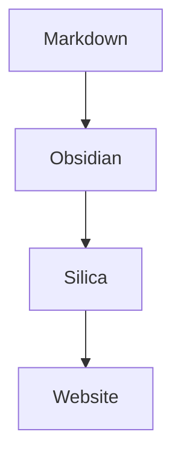

## Code blocks

Fenced code blocks are syntax-highlighted automatically. Add a language after the opening fence:

````markdown
```ts
const site = "Silica";
console.log(site);
```
````

Renders as:

```ts
const site = "Silica";
console.log(site);
```

When the language is recognized, its name appears as a label on the block (for example "TypeScript" for `ts`). A wide range of languages is supported, including:

| You write              | Label        |
| ---------------------- | ------------ |
| `ts`, `typescript`     | TypeScript   |
| `js`, `javascript`     | JavaScript   |
| `tsx`, `jsx`           | TSX / JSX    |
| `py`, `python`         | Python       |
| `bash`, `sh`, `shell`  | Shell        |
| `json`, `yaml`, `toml` | Data formats |
| `md`, `markdown`       | Markdown     |

Code blocks follow the site's light and dark mode automatically.

## Mermaid diagrams

Use a `mermaid` code fence to draw a diagram:

````markdown

````

Renders as:


