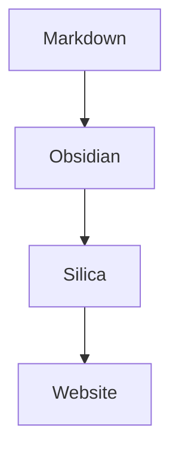

Silica detects Mermaid code fences and renders them through the theme's `silica-mermaid` component.

## Syntax

Use a fenced code block with the `mermaid` language:

````markdown

````

## Rendered example


The default theme currently shows a source fallback. Themes can override `silica-mermaid` to render diagrams client-side.
