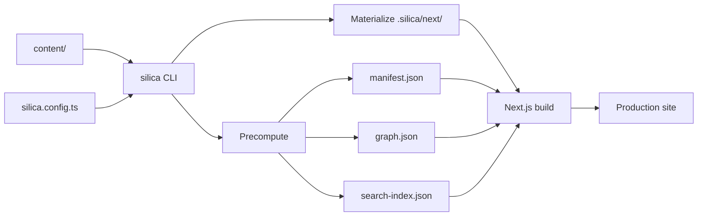

Silica keeps your project small — you edit Markdown and one config file. When you run `silica dev` or `silica build`, Silica generates a full website from that content.

## Your project vs generated files

You only touch:

- `content/` — your Markdown vault
- `public/` — static files served at the site root
- `silica.config.ts` — site settings

Silica writes everything else under `.silica/` when you run a command. That folder is disposable — delete it any time and Silica recreates it on the next run.

| Generated file              | Purpose                                      |
| --------------------------- | -------------------------------------------- |
| `.silica/next/`             | Full Next.js app (routes, API, theme wiring) |
| `.silica/manifest.json`     | Page index with titles and frontmatter       |
| `.silica/graph.json`        | Link graph and backlinks                     |
| `.silica/search-index.json` | Full-text search index                       |
| `.silica/config.json`       | Resolved config for the runtime              |

Never edit `.silica/next/` by hand — changes are overwritten on the next run.

## Build pipeline

1. **Materialize** — the CLI copies Next.js templates into `.silica/next/`
2. **Precompute** — scan `content/`, filter drafts, build the manifest, link graph, and search index, and copy vault assets
3. **Render** — Next.js serves pages from the precomputed data; the theme provides layout and UI components

During development, saving a file in `content/` triggers precompute and hot reload.

## Markdown pipeline

Each page flows through a remark/rehype pipeline:

1. Frontmatter parsing
2. Obsidian syntax — wikilinks, embeds, callouts, highlights, comments, block IDs, and tags
3. Link resolution — wikilinks become internal routes; broken links are marked
4. GFM and math — tables, task lists, strikethrough, and LaTeX
5. Syntax highlighting and Mermaid diagram rendering
6. React output — the theme supplies components for callouts, code blocks, embeds, and diagrams

## This docs site

The site you are reading lives in `docs/content/` inside the Silica monorepo. It uses the same pipeline and theme as any published vault.
